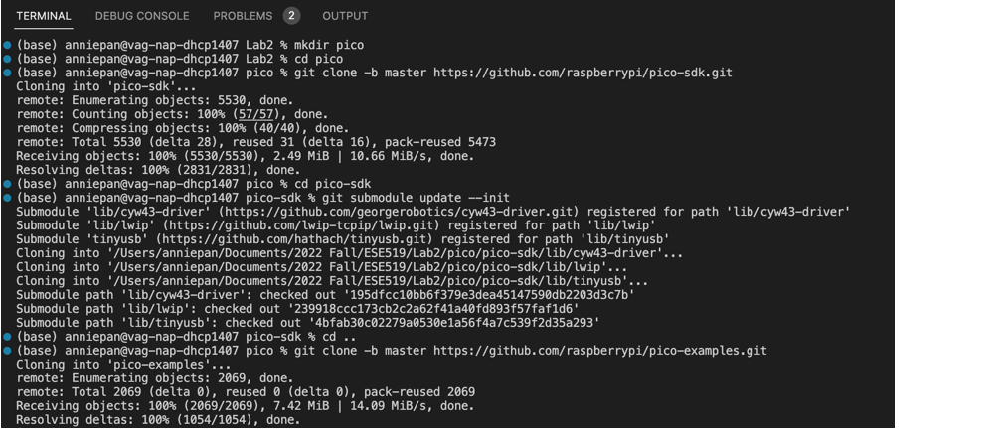
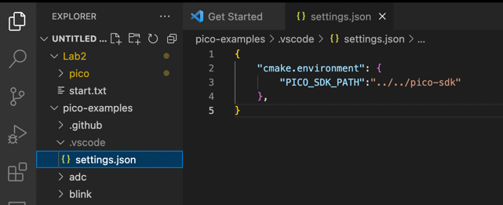
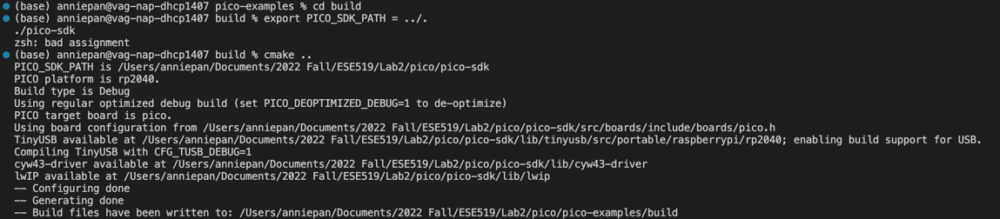
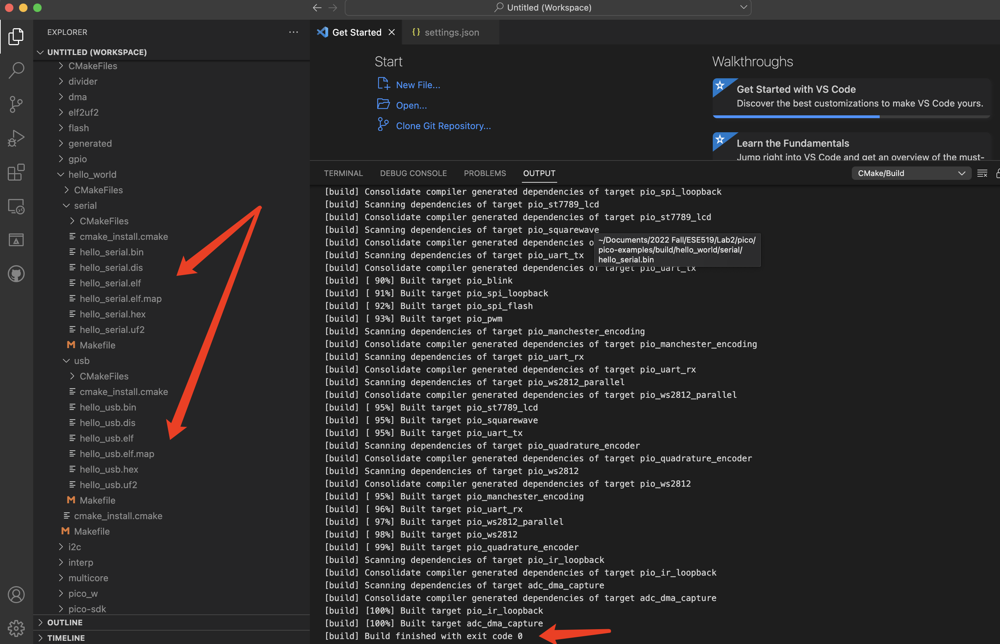
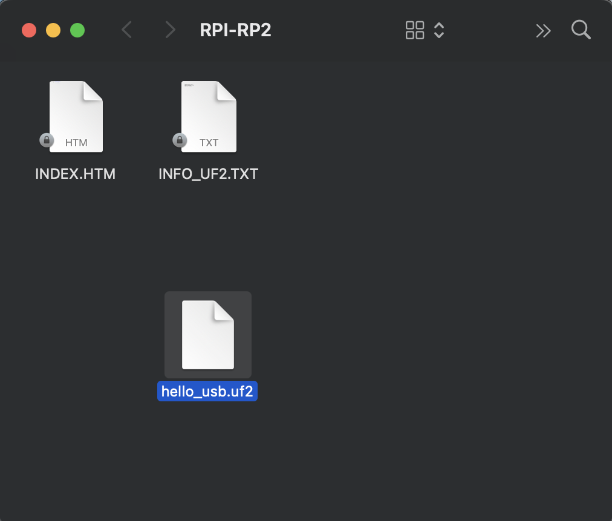
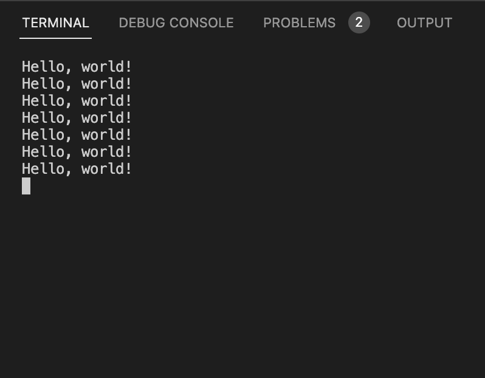

# ESE519 Lab2 setup

## 1. Install ToolChain
To build code for RP2040 on MacOS, we have to install some tools, like Homebrew, cmake and GCC. 

### 1.1 Install Homebrew
Homebrew is used for quick and safe package installation on MacOS
```Linux
 $ /bin/bash -c "$(curl -fsSL
https://raw.githubusercontent.com/Homebrew/install/master/install.sh)"
```

### 1.2 Install PICO
To start the development on the RP2040, we have to install PICO which provide support with both a C/C++ SDK.
```Linux
$ cd ~/
$ mkdir pico
$ cd pico
$ git clone -b master https://github.com/raspberrypi/pico-sdk.git
$ cd pico-sdk
$ git submodule update --init
$ cd ..
$ git clone -b master https://github.com/raspberrypi/pico-examples.git
```


### 1.3 Install CMake and other supplementary

```Linux
$ brew install cmake
$ brew tap ArmMbed/homebrew-formulae
$ brew install arm-none-eabi-gcc
```

### 1.4 Updating the SDK
To keep up with the version update, we have to use the commands below to follow up the update.
```Linux
$ cd pico-sdk
$ git pull
$ git submodule update
```

## 2. Building with CMake Tool
To use VScode for programing in C, there are few steps for setup the "CMake Tool" extensions in VScode.

### 2.1 Set up 'PICO_SDK_PATH' environment variable
Change to the pico-examples directory and create a .vscode directory and add a file called settings.json to tell CMake Tools to location of the SDK.


### 2.2 Build with CMake Tool via VScode

After setting up the cmake tool configuration and choose proper CMake generator, we can add 'pico-example' to the Workspace. Once VScode load the project successfully, it will ask you to select a compiler to compile all files in 'pico-example'. Here we choose 'named 'GCC for arm-none-eabi' as the compiler and click 'Build' button on the bottom of the window to compile the files.

From the figure above, this process produce elf, bin, and uf2 targets inside the 'hellow_world' folder in newly constructed 'build' directory.


## 3. Hello world
By connecting the RP2040 to the PC via micro-USB cable and keeping pressing the BOOTSEL button, the RP2040 will go into USB Mass Storage Mode. 

Once we Drag-and-drop either the hello_usb.uf2 onto the Mass Storage Device, the board will reboot, unmounting itself as a Mass Storage Device, and start to run the flashed code.
Input the code below in the terminal, we can see the result 'Hello, world!' from the board collected from the port.
```Linux
screen /dev/tty.usbmodem2101 115200
```
